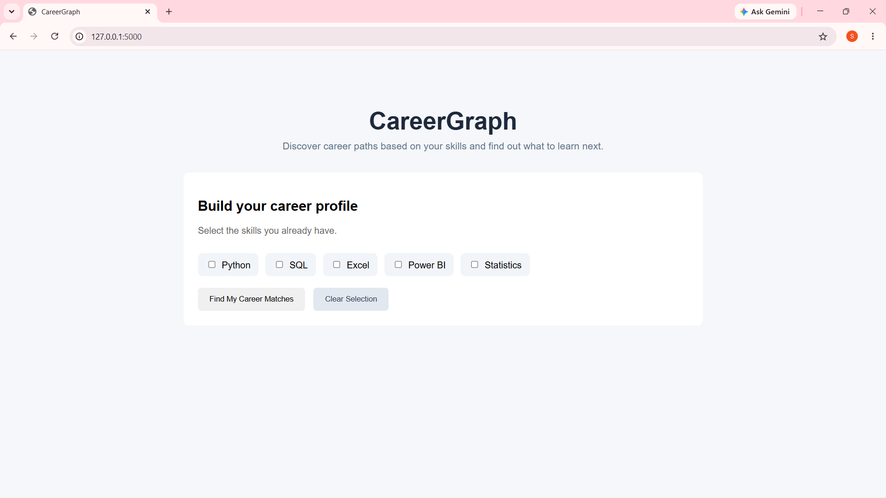
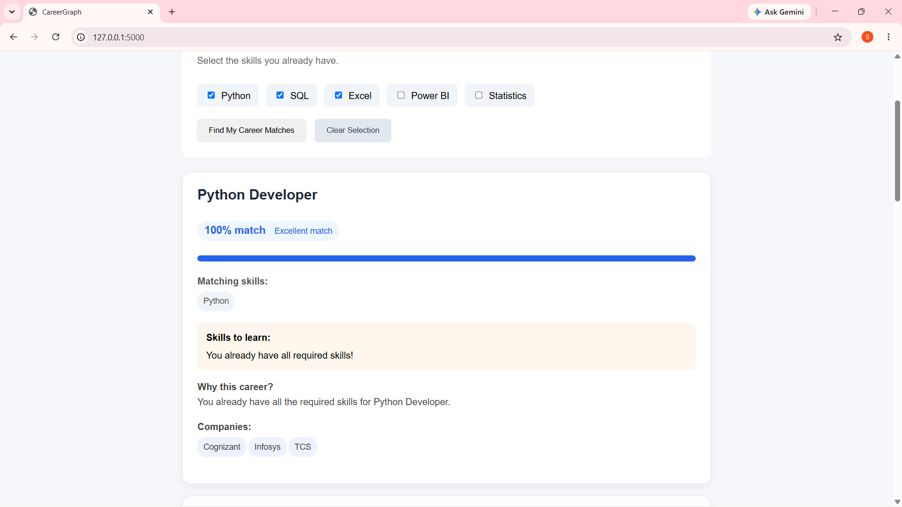
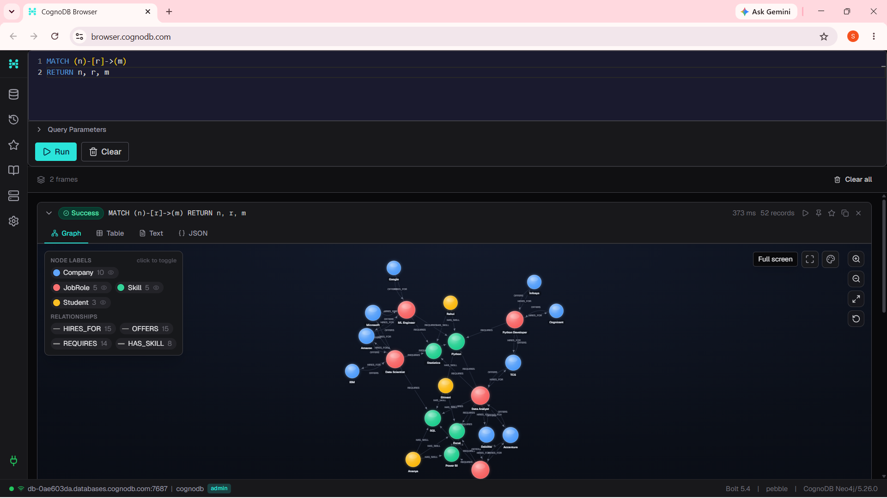

# CareerGraph

CareerGraph is a graph-powered career recommendation application built using Flask and CognoDB.

## Live Demo

[CareerGraph Live Application](https://careergraph-oi12.onrender.com/)

It helps users discover suitable career roles based on the skills they already have. For each recommended career, the application shows:

- Match percentage
- Matching skills
- Skills the user needs to learn
- Companies associated with the career

---

## Problem Statement

Choosing a career path can be difficult when a person has several skills but does not know which roles best match them.

CareerGraph models the relationships between:

- Students
- Skills
- Career roles
- Companies

This allows the application to recommend career paths based on the connections between a user's skills and the skills required by different roles.

---

## Why a Graph Database?

Career recommendations are naturally relationship-driven.

A user's skills connect to career roles, while career roles connect to companies.

The graph structure can represent these relationships directly:

```text
Student
   |
   | HAS_SKILL
   v
 Skill
   ^
   | REQUIRES
   |
JobRole
   ^
   | OFFERS
   |
Company
```

## Features

### Career Matching

Users select the skills they currently have and CareerGraph calculates a match percentage for available career roles.

### Matching Skills

The application shows which required skills the user already possesses.

### Skills to Learn

The application identifies skills required by a role that the user does not currently have.

### Company Recommendations

CareerGraph displays companies associated with each recommended career role.

### Match Explanation

Each recommendation includes a short explanation of why the role matches the user's current skills.

### Interactive UI

The application provides:

- Skill selection
- Loading state
- Empty state
- Career recommendation cards
- Match progress bars
- Skill chips
- Company chips
- Clear Selection functionality

---

## Technology Stack

- **Python**
- **Flask**
- **CognoDB**
- **Neo4j Python Driver**
- **openCypher**
- **HTML**
- **CSS**
- **JavaScript**
- **Git / GitHub**

---

## Graph Data Model

### Nodes

| Node | Description |
|---|---|
| `Student` | Represents a user/student |
| `Skill` | Represents a technical or analytical skill |
| `JobRole` | Represents a career role |
| `Company` | Represents a company associated with a career role |

### Relationships

| Relationship | Meaning |
|---|---|
| `Student -[:HAS_SKILL]-> Skill` | A student possesses a skill |
| `JobRole -[:REQUIRES]-> Skill` | A career role requires a skill |
| `Company -[:OFFERS]-> JobRole` | A company offers a career role |

### Graph Structure

```text
                   ┌──────────────┐
                   │   Student    │
                   └──────┬───────┘
                          │
                      HAS_SKILL
                          │
                          ▼
                   ┌──────────────┐
                   │    Skill     │
                   └──────▲───────┘
                          │
                       REQUIRES
                          │
                   ┌──────┴───────┐
                   │   JobRole    │
                   └──────▲───────┘
                          │
                         OFFERS
                          │
                   ┌──────┴───────┐
                   │   Company    │
                   └──────────────┘
```
---

## Example Data

### Skills

- Python
- SQL
- Excel
- Power BI
- Statistics

### Career Roles

- Data Analyst
- Data Scientist
- Business Analyst
- Python Developer
- ML Engineer

### Companies

- Cognizant
- Infosys
- TCS
- Deloitte
- Accenture
- Microsoft
- Amazon
- IBM
- EY
- Google

The data is loaded using the seed script located at:

```text
database/seed.py
```
---

## How Career Matching Works

When a user selects their existing skills, the frontend sends those skills to the Flask API:

```text
POST /api/recommendations
```

The API passes the selected skills to a parameterized Cypher query.

The query:

1. Finds career roles requiring the selected skills.
2. Counts the matching skills.
3. Finds all skills required by each role.
4. Identifies skills the user still needs to learn.
5. Finds companies offering each role.
6. Calculates the match percentage.
7. Returns the recommendations to the frontend.

The match percentage is calculated as:

```text
Match Percentage =
(Number of Matching Skills / Number of Required Skills) × 100
```

---

## Main Cypher Query

The recommendation query uses the `$skills` parameter rather than concatenating user input into the Cypher query.

```cypher
MATCH (role:JobRole)-[:REQUIRES]->(skill:Skill)
WHERE skill.name IN $skills

WITH role,
     collect(DISTINCT skill.name) AS matching_skills,
     count(DISTINCT skill) AS matched_count

MATCH (role)-[:REQUIRES]->(required:Skill)

WITH role,
     matching_skills,
     matched_count,
     collect(DISTINCT required.name) AS required_skills,
     count(DISTINCT required) AS required_count

OPTIONAL MATCH (company:Company)-[:OFFERS]->(role)

WITH role,
     matching_skills,
     matched_count,
     required_skills,
     required_count,
     collect(DISTINCT company.name) AS companies

RETURN role.title AS role,
       matching_skills,
       [skill IN required_skills
        WHERE NOT skill IN matching_skills] AS missing_skills,
       round(100.0 * matched_count / required_count) AS match_percentage,
       companies

ORDER BY match_percentage DESC
```

---

## Multi-Hop Graph Query

CareerGraph also uses graph traversal to find companies associated with career roles that require a particular skill.

For example, this query finds companies connected to roles requiring Python:

```cypher
MATCH (company:Company)-[:OFFERS]->(role:JobRole)-[:REQUIRES]->(skill:Skill)
WHERE skill.name = "Python"
RETURN company.name AS company,
       role.title AS role,
       skill.name AS skill
ORDER BY company.name
```

This represents a multi-hop traversal:

```text
Company
   |
 OFFERS
   ↓
JobRole
   |
REQUIRES
   ↓
Skill
```

This demonstrates how CareerGraph can navigate through multiple relationships in the graph to discover connections between companies, career roles, and skills.

This type of relationship traversal is natural in a graph database because companies, career roles, and skills are directly connected through typed relationships. In a relational database, the same traversal would require joining multiple tables such as `Company`, `JobRole`, and `Skill`, making relationship-focused queries more complex as the number of connected entities grows.

---

## Project Structure

```text
CareerGraph/
│
├── app.py
│
├── database/
│   └── seed.py
│
├── templates/
│   └── index.html
│
├── test_connection.py
│
├── .gitignore
│
└── README.md
```

---

## Setup

### 1. Clone the Repository

```bash
git clone https://github.com/shivanirao18/CareerGraph.git
cd CareerGraph
```

### 2. Create a Virtual Environment

On Windows:

```powershell
python -m venv venv
```

Activate it:

```powershell
venv\Scripts\activate
```

### 3. Install Dependencies

```powershell
pip install flask python-dotenv neo4j
```

---

## CognoDB Setup

CareerGraph uses CognoDB Cloud as its graph database.

### 1. Create a CognoDB Account

Go to the CognoDB Cloud console and create an account.

### 2. Create a Free Instance

Create a free `c0` CognoDB instance and select a region.

The instance provides a Bolt connection URI and database credentials.

### 3. Get the Connection Details

CognoDB provides:

- Connection URI
- Username
- Password

The application reads these values from environment variables.

Create a `.env` file in the project root:

```text
COGNODB_URI=your_cognodb_uri
COGNODB_USERNAME=your_username
COGNODB_PASSWORD=your_password
```

Replace the placeholder values with your CognoDB credentials.

### 4. Keep Credentials Private

The `.env` file contains sensitive database credentials and must not be committed to GitHub.

The project uses environment variables so database credentials are kept separate from the application source code.


---

## Seed the Database

From the project root:

```powershell
python database/seed.py
```

The seed script creates:

- Skills
- Job roles
- Students
- Student-skill relationships
- Companies
- Company-role relationships

Expected output:

```text
CareerGraph seed completed successfully!
```

---

## Run the Application

From the project root:

```powershell
python app.py
```

The application will start at:

```text
http://127.0.0.1:5000
```

Open that address in your browser.

---

## Test the Database Connection

The application provides a database connection test endpoint:

```text
http://127.0.0.1:5000/test-db
```
---
A successful connection should return:

```text
CognoDB connection successful! Result: 1
```

## Screenshots

### CareerGraph Home Page

The main interface allows users to select the skills they already have.



### Career Recommendations

CareerGraph displays recommended roles with match percentages, matching skills, skills to learn, and associated companies.



### CognoDB Graph

The graph database represents the relationships between students, skills, career roles, and companies.


